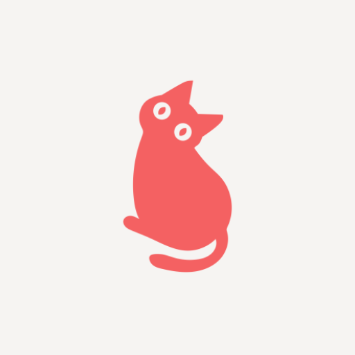

# Cat Challenge

    

    Cat Challenge App for Managing Cat Breeds & Favorites using Modern Android Development.

## 📚 Stack

- Jetpack Compose
- Jetpack Navigation Component
- Coroutines
- Hilt
- Retrofit
- Room
- Mockk

## Open API

This project utilizes [The Cat API](https://thecatapi.com/) to fetch data through a RESTful API for cat breed information and
related features

## Logo Attribution

"Cat" Logo created by [DaeSung LEE](https://thenounproject.com/creator/lds1942/) from Noun Project.